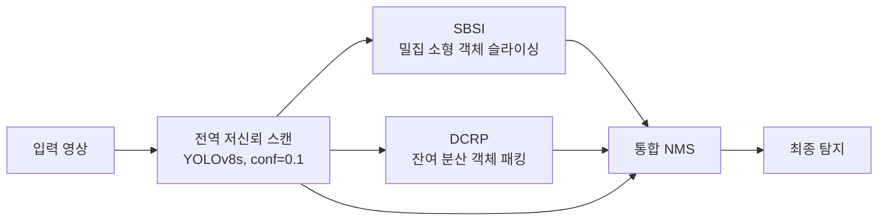

# HAHI — 밀도와 동적 패킹을 활용한 고해상도 영상 소형 객체 탐지

**Efficient High-Resolution Object Detection via Hybrid-Aided Hyper Inference: Utilizing Density and Dynamic Packing**
한병정, 한양대학교 공학대학원 컴퓨터공학 석사학위논문 (2026)

## 문제

YOLO 계열 탐지기는 입력 영상을 고정 크기(640×640)로 줄이기 때문에 4K·8K 영상의 작은 표적 정보가 대부분 사라집니다. 이를 보완하는 슬라이싱 기법은 패치 수만큼 추론 횟수·시간·VRAM이 늘어나 실시간 처리가 어렵고, 패킹 기법은 속도는 빠르지만 작은 객체 정확도가 떨어집니다.

기존 기법(DAHI, Patch Packing)을 분석한 결과, 성능을 좌우하는 결정(슬라이싱 위치, 패치 배치)을 고정값·휴리스틱에 맡기고 슬라이싱과 패킹 중 한쪽에만 치우쳐 있다는 한계를 찾았습니다. HAHI는 이 결정을 수학적 최적화 문제로 바꾸고, 두 방식을 역할에 따라 나눠 결합합니다.

## 파이프라인

### 1. SBSI (Small object Based Slicing Inference)

중·대형 객체를 제외하고, 소형 객체 중심점을 슬라이싱 창의 후보 앵커로 사용합니다.

- **가중 가우시안 앵커 탐색**: 전역 추론의 신뢰도와 크기로 객체별 정보 가중치 $w_i$를 계산합니다(신뢰도가 낮을수록, 소형 객체 중 면적이 클수록 큼). 가우시안 커널 밀도추정으로 영상 전체를 연속 밀도 공간으로 만들고 최적 앵커를 찾습니다.

$$D(\mathbf{x}) = \sum_i w_i \exp\left(-\frac{\lVert \mathbf{x} - \mathbf{p}_i \rVert^2}{2\sigma^2}\right), \qquad \mathbf{x}^* = \arg\max_{\mathbf{x}} D(\mathbf{x})$$

- **가중 무게중심 스내핑**: 앵커가 군집 가장자리에 있으면 주변 문맥이 부족해지므로, 창 안 객체들의 커널 영향으로 가중한 무게중심으로 창을 이동시켜 군집 중심에 맞춥니다.
- 확정된 영역을 추론하고, 포함된 객체를 제외한 뒤 임계값을 만족하는 군집이 없을 때까지 반복합니다.

### 2. DCRP (Dynamic Context Rearrangement Pipeline)

SBSI가 처리하지 않은 흩어진 객체를 한 번의 추론으로 처리합니다.

- **분산 객체 동적 업스케일링**: 객체 크기에 반비례하는 로지스틱 역거듭제곱 배율(최대 배율에서 시작)로 작은 객체의 정보를 보존
- **패킹 캔버스 배치**: 높이 내림차순으로 가상 캔버스에 배치하고, 역변환용 좌표·배율 메타데이터 저장
- **공간 문맥 확장(Spatial Context Extension)**: 캔버스의 남는 공간을 원본의 인접 좌표로 채워 각 패치의 주변 문맥을 최대화. 영상 경계에 닿으면 남은 여백은 중립 패딩으로 분배

## 실험 환경

| 항목 | 설정 |
|---|---|
| 모델 | YOLOv8s (VisDrone 학습, 입력 640×640) |
| 데이터 | VisDrone, 검증 영상 1,294장 (HR: 1920×1080 이상 / LR: 미만) |
| 평가 | MS COCO 공식 평가 API (pycocotools) |
| 환경 | Windows 11, Python 3.10.11, PyTorch 2.7.0+cu128, NVIDIA RTX 5050 8GB |

## 결과

### 탐지 정확도

| 방법 | 구분 | mAP | AP50 | APs | APm | APl |
|---|---|---|---|---|---|---|
| UC(2×2) | ALL | 0.2350 | 0.3967 | 0.1268 | 0.3270 | 0.4244 |
| DAHI | ALL | 0.2391 | 0.4002 | 0.1375 | 0.3202 | 0.4196 |
| Patch Packing | ALL | 0.2328 | 0.3811 | 0.1113 | 0.3332 | 0.4325 |
| **HAHI (SBSI+DCRP)** | **ALL** | **0.2498** | **0.4183** | **0.1396** | **0.3429** | **0.4336** |
| DAHI | HR | 0.2449 | 0.4095 | 0.1360 | 0.2889 | 0.4235 |
| Patch Packing | HR | 0.2340 | 0.3829 | 0.0967 | 0.2989 | 0.4304 |
| **HAHI (SBSI+DCRP)** | **HR** | **0.2613** | **0.4372** | **0.1421** | **0.3213** | **0.4371** |

- 고해상도 소형 객체 정확도(APs)는 Patch Packing보다 약 **46.9%** 높았습니다.
- 단계별 비교(DAHI+Packing, SBSI+Packing)에서도 모든 시나리오에서 가장 높았습니다.

### 자원·속도 (고해상도)

| 방법 | Peak VRAM | 영상당 추론 횟수 | 추론 시간 |
|---|---|---|---|
| UC(2×2) | 267.0 MB | 5.0 | 42.8 ms |
| DAHI | 619.7 MB | 8.1 | 77.4 ms |
| Patch Packing | 188.9 MB | 2.8 | 33.1 ms |
| **HAHI** | **224.1 MB** | **3.7** | **40.1 ms** |

- VRAM은 UC(2×2)보다 16.2% 적고, 추론 시간은 DAHI의 51.8% 수준입니다.

## 한계

- 단일 백본(YOLOv8s)과 단일 데이터셋(VisDrone)에서 평가했습니다.
- Patch Packing보다 고해상도 추론이 약 7ms 느립니다.
